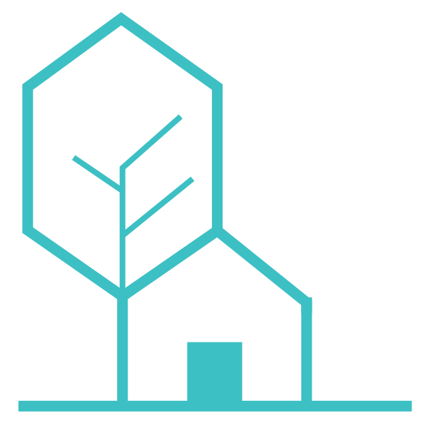
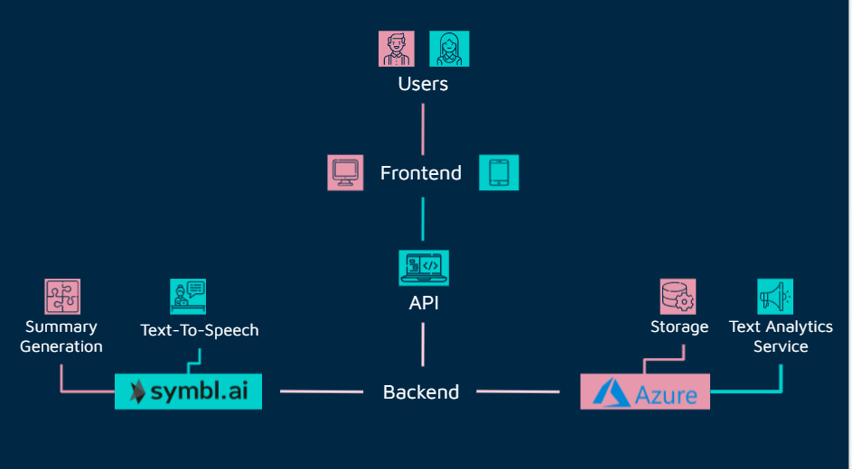
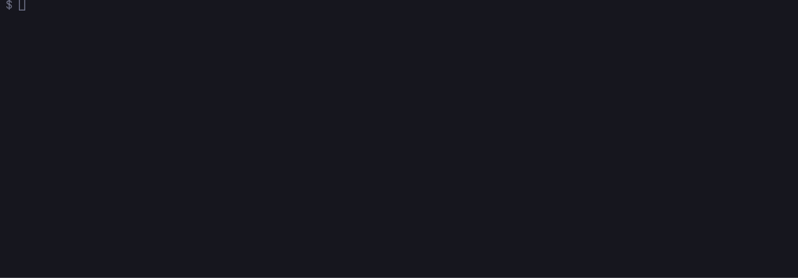

[![Contributors][contributors-shield]][contributors-url]
[![Forks][forks-shield]][forks-url]
[![Stargazers][stars-shield]][stars-url]

<!-- PROJECT LOGO -->
<br />
<p align="center">
  <a href="https://github.com/codekavya/smartschool-frontend">
    
  </a>

  <h3 align="center">Smart School Frontend</h3>

  <p align="center">
    A natural language processing-powered cross-platform service for students of the future.
    <br />
    <a href="#about-the-project"><strong>Explore the readme »</strong></a>
    <br />
    <br />
    <a href="https://codekavya.com">Contact Us</a>
   
  </p>
</p>

<!-- TABLE OF CONTENTS -->
<details open="open">
  <summary>Table of Contents</summary>
  <ol>
    <li>
      <a href="#about-the-project">About The Project</a>
      <ul>
        <li><a href="#built-with">Built With</a></li>
      </ul>
    </li>
    <li>
      <a href="#getting-started">Getting Started</a>
      <ul>
        <li><a href="#prerequisites">Prerequisites</a></li>
        <li><a href="#installation">Installation</a></li>
        <li><a href="#confif">Confif</a></li>
      </ul>
    </li>
    <li><a href="#license">License</a></li>
    <li><a href="#contact">Contact</a></li>
  </ol>
</details>

# About the project

A natural language processing-powered cross-platform service for students of the future.

These repository is accompanied by the following repositories.

# Backend

<a href="https://github.com/codekavya/smartschool-backend">
  
</a>    
<a href="https://github.com/codekavya/smartschool-mobile">
  
</a>

## Built With

This project is built using.

-  [React JS](https://reactjs.org/)

This is the list of technologies that we are using for the backend of the project.

-  [Node js](https://nodejs.org/en/)
-  [Express](http://expressjs.com/)
-  [MongoDb](https://www.mongodb.com/)
-  [Mongoose](https://mongoosejs.com/)
-  [JWT](https://jwt.io/)
-  [Azure Blob Storage](https://azure.microsoft.com/en-us/services/storage/blobs/)
-  [Azure Text Analytics](https://azure.microsoft.com/en-us/services/cognitive-services/text-analytics/)
-  [Symbl Ai](https://symbl.ai/)

# Structure



# Getting Started

## Prerequisites

_You need to have [`node v14.16.0`](https://nodejs.org/en/) or later to run this project since we're using es6+ features_

Create a mongodb account from [https://www.mongodb.com/](https://www.mongodb.com/), make a database and obtain mongodb uri.

You need to create [Azure Blob Storage](https://azure.microsoft.com/en-us/services/storage/blobs/) account and create a [Text Analytics resource](https://azure.microsoft.com/en-us/services/cognitive-services/text-analytics/) with Custom question-answering feature enabled, then proceed to create QnAmaker [(Guide)](https://docs.microsoft.com/en-us/azure/cognitive-services/qnamaker/overview/overview). Now, sign up for [Symbl](https://symbl.ai/) Make Sure to fill in all the details in [Config](#Config).

## Installation

**Clone the repository to your device.FRONTEND**

```bash
git clone https://github.com/codekavya/smartschool-frontend.git
```

**Clone the repository to your device.BACKEND**

```bash
git clone https://github.com/codekavya/smartschool-backend.git
```

**Change your current directory into the project.FRONTEND**

```bash
cd smartschool-backend
```

**Change your current directory into the project.BACKEND**

```bash
cd smartschool
```

**Install dependencies**

```bash
npm i
```

**Run the project with nodemon for hot restart**

```bash
npm run dev
```



## Config

```js
export default {
	jwtsigninKey: "",
	mongoDbKey: "",
	localKey: "",
	SYMBL_APP_ID: "",
	SYMBL_APP_SECRET: "",
	AZURE_STORAGE_ACCOUNT_NAME: "",
	AZURE_STORAGE_ACCOUNT_ACCESS_KEY: "",
	QnA_subscription_key: "",
	QnA_endpoint: "",
	QnA_runtime_endpoint: "",
	Resource_Name: "",
};
```


<!-- CONTACT -->
## Contact

Codekavya - [@codekavya](https://twitter.com/codekavya) - contact@codekavya.com


[contributors-shield]: https://img.shields.io/github/forks/codekavya/smartschool-frontend?style=for-the-badge
[contributors-url]: https://github.com/codekavya/smartschool-frontend/graphs/contributors
[forks-shield]: https://img.shields.io/github/forks/codekavya/smartschool-frontend?style=for-the-badge
[forks-url]: https://github.com/codekavya/smartschool-frontend/network/members
[stars-shield]: https://img.shields.io/github/stars/codekavya/smartschool-frontend?style=for-the-badge
[stars-url]: https://github.com/codekavya/smartschool-frontend/stargazers


